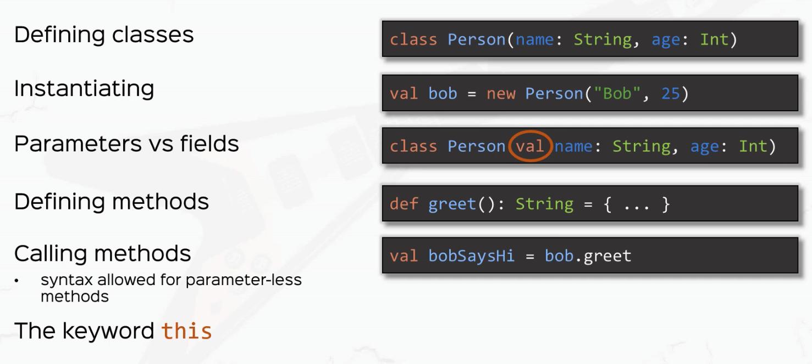

# Scala


## Scala with OOP

### Values Variables Types


- `val` - immutable, cannot change vals

  - ```scala
    val x: Int = 12
    // x cannot be reassigned since x is a VAL
    ```

- `val` type is optional, complier can inder types

  - ```scala
    val x = 42
    ```

- `;` semicolumn is optional. Encouraged not to write `;` and write code on seperate lines

- `var` - mutable, can be re-assigned

- A variable is called **side effect**

### Expressions


- Everything in Scala is an **Expression** NOT an Instruction

- Imperative programming (命令式编程): Java/Python/C

  - **NEVER** write imperative code in Scala

- `if` acts significantly different than other languages

  - if in Scala is an **Expression**, and it returns a value

  - Python/JS, we gave instructions let PC do something, but here in Scala or FP, we gave expressions, example below

```scala
// IF expression
val aCondition = true
val aConditionedValue = if(aCondition) 5 else 3 // IF EXPRESSION
println(aConditionedValue)
println(if(aCondition) 5 else 3)
```

- Loop exists in Scala but we do not encourage using them

  - Loop only excutes side effects but not returning values

- ```scala
  val aWeridValue = (aVariable = 3) // Unit === void
  ```

  - `aWeirdValue` is type of `unit`
  - Any side effects in Scala are actually expressions returning unit as value
  - side effects: println(), whiles, reassigning --- returning unit as value

- Code blocks:

  - Code blocks are expressions

    - And the value of the code block is the LAST expression of the code block

    - So the below example, this code block's value is if expression's value

    - ```scala
        val aCodeBlock = {
        
          val y = 2
          val z = y + 1
        
          if(z > 2) "hello" else "goodbye"
        
        }
      ```

  - Whatever in the code block is only visible inside the code block

- DO NOT USE WHILE LOOPS in Scala

### Functions

- Syntax:

  - ```scala
      def aFunction(a: String, b: Int): String = {
        a + " " + b
      }
    ```

- When you need loops, use **TAIL** recursion

  - ```scala
      def aRepeatedFunction(aString: String, n: Int): String = {
        if (n == 1) aString
        else aString + aRepeatedFunction(aString, n-1)
      }
    ```

- Can use auxiliary function to determine return type of the parent/outer function

  - ```scala
    def aBigFunction(n: Int): Int = {
      def aSmallerFunction(a: Int, b: Int) = a + b
    
      // Can use auxiliary function to determine return type of the parent/outer function
      aSmallerFunction(n, n - 1)
    }
    ```

### Type Inference

- Most of the time, complier can figure out the type on its own

  - 

  - 

- Recursive functions need to be specified Typed, complier won't infer types
  - 

### Recursion

- Tail Recursion

- TAIL RECURSION = use recursive call as the LAST expression

- use `@tailrec` in the function that has recursion, so the IDE will error if didn't use it as Tail Recursion

  - Two examples below to show how to make big recursion work in Scala

    - This one won't work - StackOverFlow

    ```scala
    def factorial(n: Int): Int =
      if (n <= 1) 1
      else {
        val result = n * factorial(n-1)
        result
      }
    ```

    - But this one works:

      ```scala
      def anotherFactorial(n: Int): Int = {
        def factHelper(x: Int, accumulator: Int): Int =
          if (x <= 1) accumulator
          else factHelper(x - 1, x * accumulator)
      
        factHelper(n, 1)
      }
      ```

  - The second one, we write the `factHelper()` function call at the very last expression of this code path, so Scala will preserve the call stack for this function, so it doesn't consume a lot memory

- AGAIN, when you need loops, USE TAIL RECURSION

- **Rule of thumb: The number of recursions you want is the number of accumulators you need in the tailRec function**

### Call-by-Name and Call-by-Value


- Call by Value`:` - computer will evaluate the value first and throw that into the function
- Call by Name`=>`  - computer throw the literal into function, the literal got evaluated when it is called in the code path

```scala
  def calledByValue(x: Long): Unit = {
    println("by value: " + x)
    println("by value: " + x)
  }

  def calledByName(x: => Long): Unit = {
    println("by name: " + x)
    println("by name: " + x)
  }

  calledByValue(System.nanoTime())
  calledByName(System.nanoTime())

// by value: 589136232950764
// by value: 589136232950764
// by name: 589136300788968
// by name: 589136301563084
```

```scala
  def calledByValue(x: Long): Unit = {
    println("by value: " + x)
    println("by value: " + x)
  }

 calledByValue(System.nanoTime())
```

Equals

```scala
  def calledByValue(x: Long): Unit = {
    println("by value: " + 589136232950764L)
    println("by value: " + 589136232950764L)
  }

 calledByValue(589136232950764L)
```

---

However,

```scala
  def calledByName(x: => Long): Unit = {
    println("by name: " + x)
    println("by name: " + x)
  }
  
  calledByName(System.nanoTime())
```

Equals

```scala
  def calledByName(x: => Long): Unit = {
    println("by name: " + System.nanoTime())
    println("by name: " + System.nanoTime())
  }
  
  calledByName(System.nanoTime())
```

### Default and Named Arguments


- Syntax

```scala
def trFact(n: Int, acc: Int = 1): Int =
  if (n <= 1) acc
  else trFact(n - 1, n * acc)
```

### Smart Operations on Strings

- From Java

  - ```scala
      // From Java
      println(str.charAt(2))
      println(str.substring(7, 11))
      println(str.split(" ").toList)
      println(str.startsWith("Hello"))
      println(str.replace(" ", "-"))
      println(str.toLowerCase())
      println(str.toUpperCase())
      println(str.length())
    ```

- Only in Scala

  - ```scala
      // Only in Scala
      val aNumberString = "45"
      val aNumber = aNumberString.toInt
      println('a' +: aNumberString :+ 'z') // prepending and appending
      println(str.reverse)
      println(str.take(2))
    ```

- Scala Intepolators

  - ```scala
      // S-interpolators
      val name = "David"
      val age = 12
      val greeting = s"Hello, my name is $name and I am $age years old"
      val anotherGreeting = s"Hello, my name is $name and I will be turning ${age + 1} years old"
      println(anotherGreeting)
      
      // F-interpolators
      val speed = 1.2f
      val myth = f"$name can eat $speed%2.2f burgers per minutes"
      println(myth)
    ```

  - 

- raw interpolators

  - ```scala
      // raw-interpolator
      println(raw"This is a \n newline")
      val escaped = "This is a \n newline"
      println(raw"$escaped")
  
  
    This is a \n newline
    This is a 
     newline
    ```
  
  - `\` escape character will not be escaped in `raw"this is \n a new line"`
  
  - but it will be escaped when works with injected value like `raw"$escaped"`

### OO Basics



- constructor can print `person.age`

  - ```scala
    class Person (name: String, val age: Int) // 
    ```

- cannot print `person.age`

  - ```scala
    class Person (name: String, age: Int)
    ```

- Need to add a `var` or `val` to the parameters, to let it be fields

- Field - values in a class

  - ```scala
    val x = 2 // Field
    ```

- Methods - functions in a class

  - ```scala
    // method
    def greet(name: String): Unit = println(s"${this.name} says: Hi, $name")
    ```

- Overloading

  - ```scala
    // overloading
    def greet(): Unit = println(s"Hi, I am $name") // if no parameter, same as this.name
    ```

- Multiple constructors

  - ```scala
    // multiple constructors
    def this(name: String) = this(name, 0)
    def this() = this("John Doe")
    ```

- **Object Immutability** - whenever you make changes to an object, you create a new object instance.

### Syntactic Sugar Method Notations


```scala
class Person(val name: String, favouriteMovie: String) {
  def likes(movie: String): Boolean = movie == favouriteMovie
  def hangOutWith(person: Person): String = s"${this.name} is hanging out with ${person.name}"
}
```

- When only one parameter for a method - `def likes(movie: String)`

  - ```scala
    val mary = new Person("Mary", "Inception")
    println(mary.likes("Inception"))
    println(mary likes "Inception") // equivalent
    // infix notation = operator notation
    ```

- In-fix notation, ALL operators are methods!!! 

  - Can define a method's name as a "+" plus sign, which is allowed in Scala

  - ```scala
    def +(person: Person): String = s"${this.name} is hanging out with ${person.name}"
    ```

  - The method actually works like an "Operator" in below example

  - ```scala
    // "operators" in Scala
    val tom = new Person("Tom", "Fight Club")
    println(mary + tom)
    println(mary.+(tom))
    ```

  -  Another good example would be plus operator is also a METHOD

  - ```scala
    println(1 + 2)
    println(1.+(2))
    ```

- Prefix notation

  - unary prefix

    ```scala
    val x = -1 // equivalent with 1.unary_-
    val y = 1.unary_-
    ```

  - **unary_prefix only works with - + ~ !**

- Postfix notation

  - Only availible for methods without parameters

  - ```scala
    // Postfix notation
    println(mary.isAlive)
    println(mary isAlive)
    ```

- `def apply()`

  - When you see an object gets called like a function, Scala will go into that object and look for a method call `apply` - example below

  - Can call `mary()` like a function

  - ```scala
    class Person(val name: String, favouriteMovie: String) {
      def likes(movie: String): Boolean = movie == favouriteMovie
      def +(person: Person): String = s"${this.name} is hanging out with ${person.name}"
      def unary_! : String = s"${name}, what the heck!?"
      def isAlive : Boolean = true
      def apply(): String = s"Hi, my name is $name and I like $favouriteMovie"
    }
    
    
      // apply
      println(mary.apply())
      println(mary())
    ```

  - This is super dope.

### Scala Objects


- Scala DOES NOT have Class Level Functionality ---- so called ("static")

- Instead, Scala use Objects

  - ```scala
    object Person {
      val N_EYES = 2
      def canFly: Boolean = false
    }
    
    // Access the val in object
    println(Person.N_EYES)
    println(Person.canFly)
    ```

- Can define Object just like Class, but Object doesn't take any parameters

- Scala object is **singleton instance** ---- object is Type + its only instance

- **Companions**

  - Can write object and a class of the same name in a file or even in a scope. ---- called companions

  - So whenever we access any value or methods, we are access it throught some kind of instance, singleton instance or regular instance

  - So, Scala is truly an Object Oriented Language, and everything is Object.

  - ```scala
    object Person { // Type + its only instance
      // "static"/"class" - level functionality
      val N_EYES = 2
      def canFly: Boolean = false
    }
    class Person {
      // instance-level functionality
    }
    // Companions
    ```

- **Design Pattern, In practice, we define Factory Methods in Object**
-   Scala Applications = Scala object with `def main(args: Array[String]): Unit`
- That is why we `extends App` for every objects, because `App` already has a `def main(args: Array[String])` inside

### Inheritance

- `private` methods cannot be access outside the class

- `protected` methods can be access only in its direct sub-class

- `public` same old public

- Constructors

  - ```scala
    // constructors
    class Person(name: String, age: Int) {
      def this(name: String) = this(name, 0)
    }
    class Adult(name: String, age: Int, idCard: String) extends Person(name)
    ```

- Overriding

  - ```scala
    // overriding
    class Dog(override val creatureType: String) extends Animal {
      // override val creatureType: String = "domestic"
      override def eat = println("crunch, crunch")
    }
    
    // Or
    class Dog1(dogType: String) extends Animal {
      override val creatureType: String = dogType
    }
    
    val dog = new Dog("K9")
    dog.eat
    println(dog.creatureType)
    ```

- Type substitution (broad: polymorphism)

  - ```scala
    // Type substitution (broad: polymorphism)
    val unknownAnimal: Animal = new Dog("K9")
    unknownAnimal.eat
    ```

- OverRIDING vs overLOADING

  - Overriding --- define method of same name in sub classes
  - Overloading --- define multiple methods of different signatures of same name in a  same class

- super --- to call father class's methods `super.eat`

- Preventing overrides

  - 1. use `final` keyword on members

  - 2. use `final` keyword on entire super class --- the super class can no longer be inherited
       - Numerical / String class are all final in Scala

  - 3. use `sealed` keyword on super class --- extend classes allowed in THIS FILE, prevent extension in other files

  - ```scala
    class Animal {
      val creatureType = "wide"
      final def eat = println("nomnom")
    }
    
    final class Animal {
      val creatureType = "wide"
      def eat = println("nomnom")
    }
    
    sealed class Animal {
      val creatureType = "wide"
      def eat = println("nomnom")
    }
    ```

- `???` return nothing

### Abstract and Trait

- Need to leave some methods/fields empty --- called abstract
- Cannot be instantiated
- traits
  - A class can have multiple traits
  - use keyword `with`
  - similiar to Java Interfaces
- Both abstract class and trait can have abstract or non-abstract members
- traits vs abstract classes
  - 1 - traits do not have constructor parameters
  - 2 - multiple traits may be inherited by the same class
  - 3 - traits = behavior, abstract class = "thing"
    - When talking about a thing, use class; when talking about doing things/behavior, use traits


- `???` returns `nothing`, when compile, complier will give a not implemented error

  - ```scala
    def head: Int = ???
    ```

- `throw new NoSuchElementException` --- throw an exception in Scala returns `nothing`


### Generics


- Code reusablity

  - ```scala
    class MyList[A] {
      // use the type A inside the class defination
    
    }
    
    class MyMap[Key, Value]
    
    val lisfOfIntegers = new MyList[Int]
    val listOfStrings = new MyList[String]
    ```

- **Class** and **traits** can both use generic types

- But, **Objects cannot** use generic types

- Use generic methods

  - ```scala
    // generic methods
    object MyList {
      def empty[A]: MyList[A] = ???
    }
    val emptyListOfIntegers = MyList.empty[Int]
    ```

- **Variance problem**

  - ```scala
    // variance problem
    class Animal
    class Cat extends Animal
    class Dog extends Animal
    ```

    - Question: if Cat extends Animal, does list of Cats extend Animal?

      1. Yes, List[Cat] extends List[Animal] = **Covariance**

      Ok to replace animal list with Cat list --- 小的换大的

      ```scala
      class CovariantList[+A]
      val animal: Animal = new Cat
      val animalList: CovariantList[Animal] = new CovariantList[Cat]
      // animalList.add(new Dog) ??? Can I add dog? HARD QUESTION
      // Yes, but adding a Dog to Cat list will pollute the animalList
      ```

      2. No = **Invariance**

      Normal usage, only put in same type

      ```scala
      // 2. No = Invariance
      class InvarianceList[A]
      // Can only put the animal Type into the list
      val invariantAnimalList: InvarianceList[Animal] = new InvarianceList[Animal]
      ```

      3. Hell, no! **Contravariance**

      Ok to replace cat with Animal --- 大的换小的

      ```scala
      // 3. Hell, no! Contravariance
      class Trainer[-A]
      val trainer: Trainer[Cat] = new Trainer[Animal]
      ```

- Bounded types

  - Upper bounded types

  ```scala
  // bounded types
  class Cage[A <: Animal] (animal: A) // class Cage only allows types that are subtypes of Animal
  val cage = new Cage(new Dog)
  ```

  - Lower bounded types

  ```scala
  class MyList[+A] {
    // use the type A inside the class defination
    def add[B >: A](element: B): MyList[B] = ???
    /*
      A = Cat
      B = Animal
    * */
  }
  // B is super type of A
  // This solves the problem when adding a Dog to a Cat list
  // It should turn the list into a Animal List instead
  ```

### Anonymous Class


- Even using anonymous class, remember to pass in the parameter to the super class you are extending
- Anonymous class works for both abstract classes and normal classes

```scala
// Example with abstract class
abstract class Animal {
  def eat: Unit
}

// anonymous class
val funnyAnimal: Animal = new Animal {
  override def eat: Unit = println("ahahahahahhaha")
}


// Example with normal Class
class Person(name: String) {
  def sayHi: Unit = println(s"Hi, my name is $name, how can I help?")
}

val jim = new Person("Jim") {
  override def sayHi: Unit = println(s"Hi, my name is Jim, how can I be of service?")
}
```

### A Scala List From Stratch

```scala
package exercises

/**
 * Created by yinhaohe on Feb 23, 2022
 */
abstract class MyList[+A]{

  /*
    head = first element of the list
    tail = remainder of the list
    isEmpty = is this list empty
    add(int) => new list with this element added
    toString => a string representation of the list
  */

  def head: A
  def tail: MyList[A]
  def isEmpty: Boolean
  def add[B >: A](element: B): MyList[B]
  def printElements: String
  // polymorphic call
  override def toString: String = "[" + printElements + "]"

  def map[B] (transformer: MyTransformer[A, B]) : MyList[B]
  def flatMap[B] (transformer: MyTransformer[A, MyList[B]]) : MyList[B]
  def filter(predicate: MyPredicate[A]) : MyList[A]

  // concatenation
  def ++[B >: A](list: MyList[B]) : MyList[B]
}

object Empty extends MyList[Nothing] {
  def head: Nothing = throw new NoSuchElementException
  def tail: MyList[Nothing] = throw new NoSuchElementException
  def isEmpty: Boolean = true
  def add[B >: Nothing](element: B): MyList[B] = new Cons(element, Empty)
  def printElements: String = ""

  def map[B] (transformer: MyTransformer[Nothing, B]) : MyList[B] = Empty
  def flatMap[B] (transformer: MyTransformer[Nothing, MyList[B]]) : MyList[B] = Empty
  def filter(predicate: MyPredicate[Nothing]) : MyList[Nothing] = Empty
  def ++[B >: Nothing] (list: MyList[B]): MyList[B] = list
}

class Cons[+A](h: A, t: MyList[A]) extends MyList[A] {
  def head: A = h
  def tail: MyList[A] = t
  def isEmpty: Boolean = false
  def add[B >: A](element: B): MyList[B] = new Cons(element, this)
  def printElements: String =
    if(t.isEmpty) "" + h
    else s"$h ${t.printElements}"

  /*
  * [1, 2, 3].filter(n % 2 == 0) =
      [2, 3].filter(n % 2 == 0) =
      = new Cons(2, [3].filter(n % 2 == 0))
      = new Cons(2, Empty.filter(n % 2 == 0))
      = new Cons(2, Empty)
  * */

  def filter(predicate: MyPredicate[A]): MyList[A] =
    if (predicate.test(h)) new Cons(h, t.filter(predicate))
    else t.filter(predicate)

  /*
  * [1, 2, 3].map(n * 2)
    = new Cons(2, [2, 3].map(n * 2))
    = new Cons(2, new Cons(4, [3].map(n * 2)))
    = new Cons(2, new Cons(4, new Cons(6, Empty.map(n * 2))))
    = new Cons(2, new Cons(4, new Cons(6, Empty)))
  * */

  def map[B] (transformer: MyTransformer[A, B]) : MyList[B] =
    new Cons(transformer.transform(h), t.map(transformer))

  /*
  * [1, 2] ++ [3, 4, 5]
  = new Cons(1, [2] ++ [3, 4, 5])
  = new Cons(1, new Cons(2, Empty ++ [3, 4, 5]))
  = new Cons(1, new Cons(2, new Cons(3, new Cons(4, new Cons(5, Empty)))))
  * */
  def ++[B >: A](list: MyList[B]) : MyList[B] = new Cons(h, t ++ list)

  /*
  * [1, 2].flatMap(n => [n, n + 1])
  = [1, 2] ++ 2.flatMap(n => [n, n + 1])
  = [1, 2] ++ [2, 3] ++ Empty.flatMap(n => [n, n + 1])
  = [1, 2] ++ [2, 3] ++ Empty
  = [1, 2, 2, 3]
  * */
  def flatMap[B] (transformer: MyTransformer[A, MyList[B]]) : MyList[B] =
    transformer.transform(h) ++ t.flatMap(transformer)
}

trait MyPredicate[-T] {
  def test(elem: T): Boolean
}

trait MyTransformer[-A, B] {
  def transform(elem: A): B
}

object ListTest extends App {
  val listOfIntegers: MyList[Int] = new Cons(1, new Cons(2, new Cons(3, Empty)))
  val anotherListOfIntegers: MyList[Int] = new Cons(4, new Cons(5, Empty))
  val listOfStrings: MyList[String] = new Cons("Hello", new Cons("Scala", Empty))

  println(listOfIntegers.toString)
  println(listOfStrings.toString)

  println(listOfIntegers.map(new MyTransformer[Int, Int] {
    override def transform(elem: Int): Int = elem * 2
  }).toString)

  println(listOfIntegers.filter(new MyPredicate[Int] {
    override def test(elem: Int): Boolean = elem % 2 == 0
  }).toString)

  println((listOfIntegers ++ anotherListOfIntegers).toString)
  println(listOfIntegers.flatMap(new MyTransformer[Int, MyList[Int]] {
    override def transform(elem: Int): MyList[Int] = new Cons(elem, new Cons(elem + 1, Empty))
  }).toString)
}
```

### Case classes


```scala
case class Person(name: String, age: Int)
```

- class parameters are frelds

```scala
// 1. class parameters are frelds
val jim = new Person("Jim", 34)
println(jim.name)
```

- sensible toString

```scala
// 2. sensible toString
// println(instance) = println(instance.toString) // syntactic sugar
println(jim)
```

- equals and hashCode implemented Out of the Box

```scala
// 3. equals and hashCode implemented Out of the Box
val jim2 = new Person("Jim", 34)
println(jim == jim2)
```

- Case classes have handy copy method

```scala
// 4. Case classes have handy copy method
val jim3 = jim.copy(age = 45)
println(jim3)
```

- Case classes have companion objects, with handy apply() method

```scala
// 5. Case classes have companion objects
// it called apply() method, which is constructor in case classes
val thePerson = Person
val mary = Person("Mary", 23)
```

- Case classes are serializable

```scala
Akka - actually send case classes through network
```

- Case classes extractor patterns = CCs can be used in PATTERN MATCHING
- There are also case objects --- almost identical to case class except itself is an object already

```scala
case object UnitedKingdom {
  def name: String = "The UK of GB and Ni"
}
```

### Enums

```scala
package lectures.part2oop

/**
 * Created by yinhaohe on Feb 27, 2022
 */
object Enums {
  enum Permissions {
    case READ, WRITE, EXECUTE, NONE

    // add fields/methods
    def openDocument():Unit =
      if (this == READ) println("opening document...")
      else println("reading not allowed.")
  }

  val somePermissions: Permissions = Permissions.READ

  // constructor args
  enum PermissionsWithBits(bits: Int) {
    case READ extends PermissionsWithBits(4) // 100
    case WRITE extends PermissionsWithBits(2) // 010
    case EXCUTE extends PermissionsWithBits(1) // 001
    case NONE extends PermissionsWithBits(0) // 000
  }

  object PermissionsWithBits {
    def fromBits(bits: Int): PermissionsWithBits = // whatever
      PermissionsWithBits.NONE
  }

  // standard API
  val somePermissionsOrdinal = somePermissions.ordinal
  val allPermissions = PermissionsWithBits.values // array of all possible values of the enum
  val readPermission: Permissions = Permissions.valueOf("READ")

  def main(args: Array[String]): Unit = {
    somePermissions.openDocument()
    println(somePermissionsOrdinal)
    println(readPermission)
  }
}
```

### Exceptions


- throw an exception --- `throw new NullPointerException`
- throwable classes extend the **[Throwable type](https://docs.oracle.com/javase/7/docs/api/java/lang/Throwable.html)** class.
- **Exception** and **Error** are the major **Throwable** subtype
- Try Catch Exceptions
- Define your own exceptions

A Good Example:

```scala
package lectures.part2oop

/**
 * Created by yinhaohe on Feb 27, 2022
 */
object Exceptions extends App {

  val x: String = null
  // println(x.length)
  // this will crash with a NPE

  // 1. throwing exceptions
  // val aWeirdValue: String = throw new NullPointerException

  // throwable classes extend the Throwable class.
  // Exception and Error are the major Throwable subtypes

  // 2. how to catch exceptions
  def getInt(withExceptions: Boolean): Int =
    if (withExceptions) throw new RuntimeException("No int for you!")
    else 42

  val potentialFail = try {
    // code that might fail
    getInt(false)
  } catch {
    case e: NullPointerException => println("caught a Runtim exception")
  } finally {
    // code that will get excuted NO MATTER WHAT
    // optional
    // does not influence the return type of this expression
    // use finally only for side effects --- E.G. log something into files
    println("finally")
  }

  println(potentialFail)

  // 3. how to define your own exceptions
  class MyException extends Exception

  val exception = new MyException

  //  throw exception

  /*
    1.  Crash your program with an OutOfMemoryError
    2.  Crash with SOError
    3.  PocketCalculator
        - add(x,y)
        - subtract(x,y)
        - multiply(x,y)
        - divide(x,y)
        Throw
          - OverflowException if add(x,y) exceeds Int.MAX_VALUE
          - UnderflowException if subtract(x,y) exceeds Int.MIN_VALUE
          - MathCalculationException for division by 0
   */

  // OOM
  // val array = Array.ofDim(Int.MaxValue)

  // SOError
  def loop: Int = 1 + loop
  // val endlessLoop = loop

  class OverflowException extends RuntimeException

  class UnderflowException extends RuntimeException

  class MathCalculationException extends RuntimeException("Division by 0")

  object PocketCalculator {
    def add(x: Int, y: Int) = {
      val result = x + y

      if (x > 0 && y > 0 && result < 0) throw new OverflowException
      else if (x < 0 && y < 0 && result > 0) throw new UnderflowException
      else result
    }

    def subtract(x: Int, y: Int) = {
      val result = x - y

      if (x > 0 && y < 0 && result < 0) throw new OverflowException
      else if (x < 0 && y > 0 && result > 0) throw new UnderflowException
      else result
    }

    def multiply(x: Int, y: Int) = {
      val result = x * y
      if (x > 0 && y > 0 && result < 0) throw new OverflowException
      else if (x < 0 && y < 0 && result < 0) throw new OverflowException
      else if (x > 0 && y < 0 && result > 0) throw new UnderflowException
      else if (x < 0 && y > 0 && result > 0) throw new UnderflowException
      else result
    }

    def divide(x: Int, y: Int) = {
      if (y == 0) throw new MathCalculationException
      else x / y
    }
  }

  // println(PocketCalculator.add(Int.MaxValue, 10))
  // println(PocketCalculator.divide(2, 0))
}
```

### Packaging and Imports


- Package members are accessible by their simple name
- If not package members, import the package
- Packages are in hierarchy
- Matching folder structure
- `package lectures.part2oop`  --- is actually NOT **expression**
- package object --- **universal constants/methods**
  - package object can only be one per package
- Group import 

```scala
import playground.{ATestClass, PrinceCharming}
```

- Import all

```scala
import playground._
```

- Name alias

```scala
import playground.{ATestClass => AnotherName, PrinceCharming}
```

- Same name import issue
  - Deal with same name import issues

```scala
import java.util.Date
import java.sql.{Date => SqlDate}

// 1. use Fully Qualified names
val date = new Date
val sqlDate = new java.sql.Date(2018, 5, 4)

// 2. use aliasing
val sqlD = new SqlDate(2018, 5, 4)
```

- There are some default imports
  -   // default imports
      // java.lang --- String, Object, Exception
      // scala --- Int, Nothing, Function
      // scala.Predef --- println, ???

## Functional Programming

### What is Function

